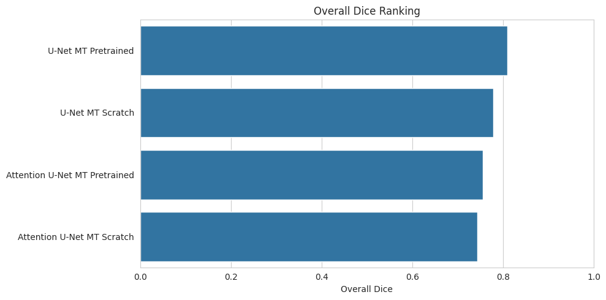
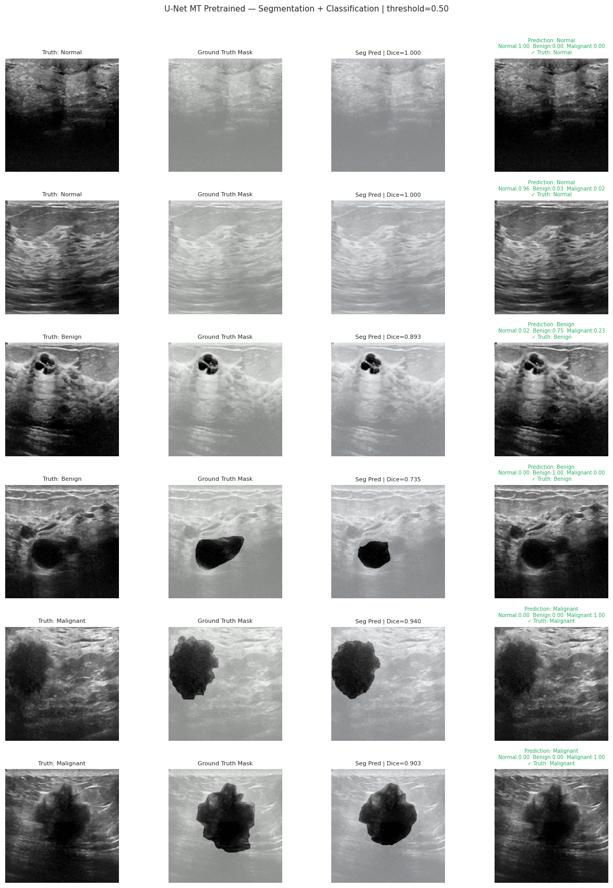
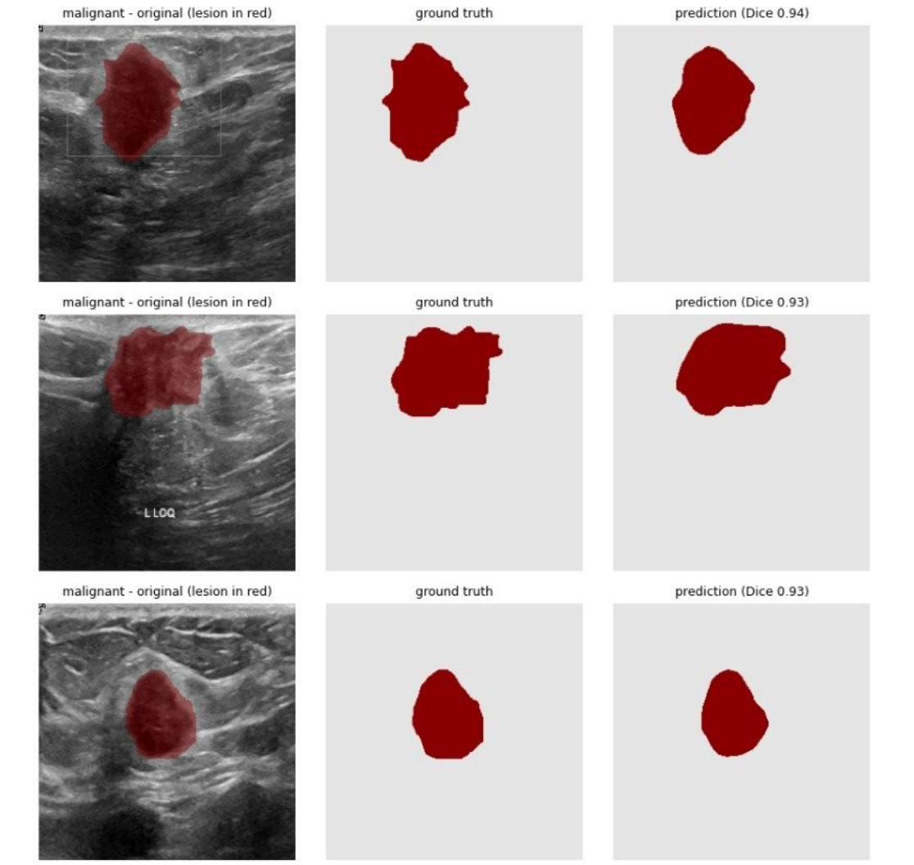
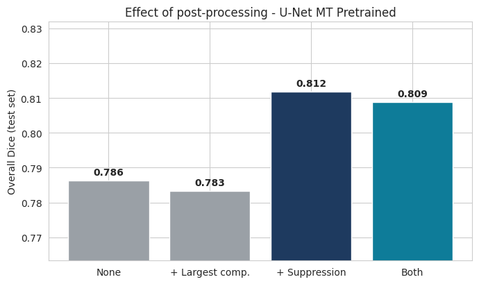
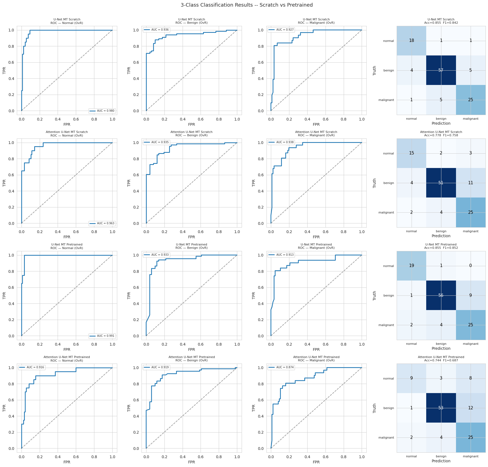

# LesionScope: Multi-Task Breast Lesion Classification and Segmentation


**LesionScope** is a multi-task deep learning project for breast ultrasound analysis. In a single forward pass, one model performs:

- **Binary lesion segmentation** — pixel-level lesion mask prediction
- **Three-class image classification** — `normal`, `benign`, or `malignant`

The project uses the public **BUSI breast ultrasound dataset** and compares four U-Net-based multi-task architectures: custom U-Net, custom Attention U-Net, ResNet34-pretrained U-Net, and ResNet34-pretrained Attention U-Net. The full study is documented in the [project report](report/LesionScope_Report.pdf).

---

## Headline result

The **ResNet34-pretrained U-Net** is selected as the best overall model because it achieves the highest overall Dice, strongest normal-subset Dice, lowest HD95, and highest macro-F1. Although the pretrained Attention U-Net obtains the highest lesion-only Dice, its normal-class performance drops substantially, so the final model is selected using **overall Dice**.

| Model | Overall Dice | Lesion Dice | Normal Dice | HD95 | Accuracy | Macro-F1 | Macro-AUC |
|---|---:|---:|---:|---:|---:|---:|---:|
| **U-Net MT Pretrained** | **0.809** | 0.780 | **0.95** | **22.67** | **0.855** | **0.852** | 0.946 |
| U-Net MT Scratch | 0.779 | 0.754 | 0.90 | 23.55 | **0.855** | 0.842 | **0.948** |
| Attention U-Net MT Pretrained | 0.756 | **0.788** | 0.60 | 23.90 | 0.744 | 0.687 | 0.903 |
| Attention U-Net MT Scratch | 0.744 | 0.732 | 0.80 | 29.89 | 0.778 | 0.758 | 0.945 |



---

## Key findings

- **Multi-task learning gives a practical clinical workflow.** One shared encoder produces both a lesion mask and a normal/benign/malignant diagnosis-style label.
- **The ResNet34-pretrained U-Net provides the best overall trade-off.** It reaches overall Dice **0.809**, normal Dice **0.95**, macro-F1 **0.852**, and macro-AUC **0.946**.
- **Attention did not provide the expected benefit in this setting.** The attention variants did not improve overall Dice and reduced normal-class stability, especially in the ResNet34-based Attention U-Net.
- **Class-aware suppression is useful for normal images.** When the classifier predicts `normal`, the segmentation mask is forced to empty, which improves overall Dice by avoiding false lesion masks on healthy images.
- **Largest-component filtering is marginal.** It removes scattered false-positive blobs, but the best model already produces fairly clean masks.

---

## Method at a glance

**Dataset.** The project uses the public BUSI dataset: **780 grayscale breast ultrasound images** with expert segmentation masks. The classes are **normal** (133), **benign** (437), and **malignant** (210). Normal images are treated as background-only segmentation targets with empty/all-zero masks.

**Split.** The data is split into stratified **70/15/15** train/validation/test subsets with a fixed random seed.

| Split | Total | Normal | Benign | Malignant |
|---|---:|---:|---:|---:|
| Train | 546 | 93 | 306 | 147 |
| Validation | 117 | 20 | 65 | 32 |
| Test | 117 | 20 | 66 | 31 |

**Models compared.**

| Model | Encoder initialization | Notes |
|---|---|---|
| U-Net MT Scratch | Random initialization | Custom U-Net-style encoder-decoder |
| Attention U-Net MT Scratch | Random initialization | Attention gates in skip connections |
| U-Net MT Pretrained | ImageNet-pretrained ResNet34 encoder | Pretrained encoder + U-Net decoder |
| Attention U-Net MT Pretrained | ImageNet-pretrained ResNet34 encoder | Pretrained encoder + attention decoder |

**Training.** All models use AdamW, OneCycleLR, mixed precision on CUDA, class-weighted cross-entropy for classification, and a BCE + Tversky segmentation loss. Early stopping is based on validation lesion Dice, while final model selection is based on held-out test overall Dice.

**Evaluation.** Segmentation is measured with Dice, IoU, precision, recall, and HD95. Classification is measured with accuracy, macro-F1, one-vs-rest macro-AUC, ROC curves, and confusion matrices. Final segmentation uses a fixed threshold of **0.5**.

---

## Qualitative examples

The best model correctly clears masks for normal images and produces accurate lesion outlines for many benign and malignant examples.



Malignant examples are especially important clinically because boundaries are often irregular and blurred:



---

## Post-processing ablation

Class-aware suppression is the main post-processing gain. Largest-component filtering has only a small effect.

| Model | None | + Largest component | + Suppression | Both |
|---|---:|---:|---:|---:|
| U-Net MT Scratch | 0.7708 | 0.7689 | 0.7806 | 0.7788 |
| Attention U-Net MT Scratch | 0.7401 | 0.7396 | 0.7443 | 0.7438 |
| **U-Net MT Pretrained** | 0.7863 | 0.7833 | **0.8119** | 0.8089 |
| Attention U-Net MT Pretrained | 0.7399 | 0.7478 | 0.7480 | 0.7560 |



---

## Classification performance

The best model reaches **0.855 accuracy**, **0.852 macro-F1**, and **0.946 macro-AUC** on the held-out test set. It correctly identifies **19 of 20 normal images** and does not assign the malignant label to any normal image.



---

## Repository structure

```text
.
├── figures/
│   ├── fig01_dataset_examples.png
│   ├── fig02_image_size_distribution.png
│   ├── fig03_lesion_area_distribution.png
│   ├── fig04_augmentation_examples.png
│   ├── fig05_postprocessing_ablation.png
│   ├── fig06_postprocessing_visual_examples.png
│   ├── fig07_training_curves.png
│   ├── fig08_dice_distribution_boxplot.png
│   ├── fig09_overall_dice_ranking.png
│   ├── fig10_four_model_predictions_general.png
│   ├── fig11_malignant_examples.png
│   ├── fig12_best_model_multitask_predictions.png
│   └── fig13_roc_curves_confusion_matrices.png
├── notebooks/
│   └── LesionScope_multitask_breast_ultrasound.ipynb
├── report/
│   └── LesionScope_Report.pdf
├── results/
│   ├── classification_summary.csv
│   ├── model_comparison.csv
│   ├── pairwise_dice_statistics.csv
│   ├── postprocessing_ablation.csv
│   ├── report_tables.md
│   ├── segmentation_summary_by_subset.csv
│   ├── split_summary.csv
│   └── summary.json
├── .gitignore
├── LICENSE
├── README.md
└── requirements.txt
```

---

## Setup & reproduction

The notebook was developed and run on Google Colab with GPU acceleration.

1. Install dependencies:

```bash
pip install -r requirements.txt
```

2. Prepare Kaggle authentication.

The BUSI dataset is downloaded through the Kaggle API. Place your own `kaggle.json` under `~/.kaggle/kaggle.json` or set `KAGGLE_USERNAME` and `KAGGLE_KEY` as environment variables.

3. Run the notebook:

```bash
jupyter notebook notebooks/LesionScope_multitask_breast_ultrasound.ipynb
```

Run the cells from top to bottom. The notebook downloads the dataset, creates the train/validation/test split, trains the four models, evaluates them, and writes tables and figures to `results/` and `figures/`.

> Model checkpoints are not committed to this repository because they are regenerated by the notebook and can be large.

---

## Limitations

- The dataset is relatively small, with 780 ultrasound images.
- The split is image-level rather than patient-level, because patient identifiers are not available in the dataset.
- The model is evaluated only on BUSI, so external validation on other ultrasound devices and hospitals is still needed.
- A small number of malignant cases are still predicted as benign or normal, which would need to be reduced before any clinical use.

---

## Authors

- Kağan Canerik — [GitHub](https://github.com/KaganCanerik)
- Özgün Serergün Koca — [GitHub](https://github.com/ozgun-koca) · ozgunserergun@gmail.com

B.Sc. Artificial Intelligence Engineering, Hacettepe University

---

## License

Released under the MIT License — see [LICENSE](LICENSE).

---

## References

- Al-Dhabyani, W., Gomaa, M., Khaled, H., & Fahmy, A. (2020). *Dataset of breast ultrasound images*. Data in Brief, 28, 104863.
- Ronneberger, O., Fischer, P., & Brox, T. (2015). *U-Net: Convolutional networks for biomedical image segmentation*. MICCAI.
- Oktay, O., Schlemper, J., Le Folgoc, L., et al. (2018). *Attention U-Net: Learning where to look for the pancreas*. MIDL.
- He, K., Zhang, X., Ren, S., & Sun, J. (2016). *Deep residual learning for image recognition*. CVPR.
